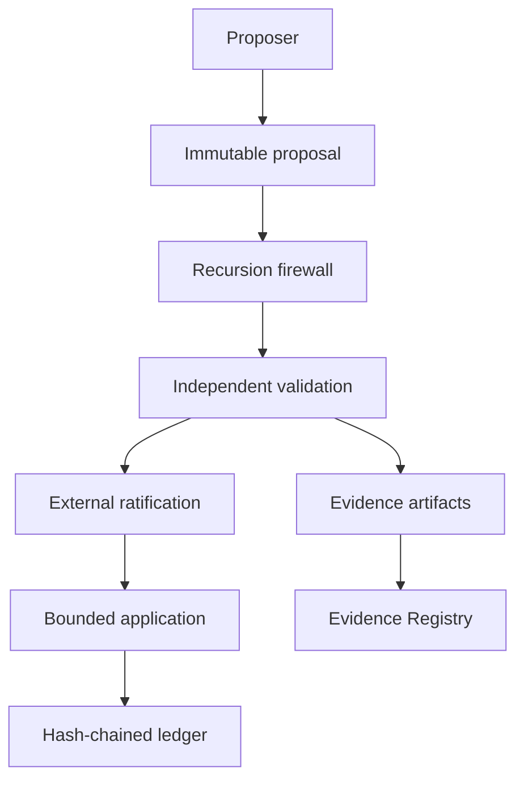

# Governed-RSI master architecture

## Scope

This document describes a bounded research architecture for governing change proposals from
increasingly capable systems. The filename preserves the project's AGI/ASI research context;
the implementation does not claim AGI or ASI.

## Control flow

The proposer never receives a direct edge to application, trust-root mutation, or evidence
promotion. Every transition is represented as a receipt in the ledger.

## Components

| Component | Inputs | Outputs | Authority limit |
|---|---|---|---|
| MGRE kernel | proposal, actor identity | transition receipt | cannot promote evidence |
| Authority Registry | actor, requested action | allow/deny | cannot self-amend |
| Recursion Firewall | changed paths, authority request | findings | cannot ratify |
| Verifier | public key, envelope | verification result | contains no signing key |
| State Machine | current state, event | next state | rejects unspecified transitions |
| Ledger | canonical event | hash-linked record | append-only API |
| Evidence Registry | receipts and evaluator identity | promotion decision | distinct evaluator required |
| Release boundary | approved tree | manifests and bundle | cannot determine tier |

## Data invariants

- All evaluated objects use deterministic JSON serialization.
- Proposal identity binds proposer, paths, intent, and content digests.
- Ledger records bind sequence number, prior record hash, and event payload.
- Release identity uses a payload manifest and a separately signed bundle manifest.
- An evidence claim identifies both producer and evaluator.

## Non-goals

- autonomous code deployment;
- online model-weight modification;
- universal policy reasoning;
- proof of corrigibility or containment;
- automated assignment of E4 or E5.
