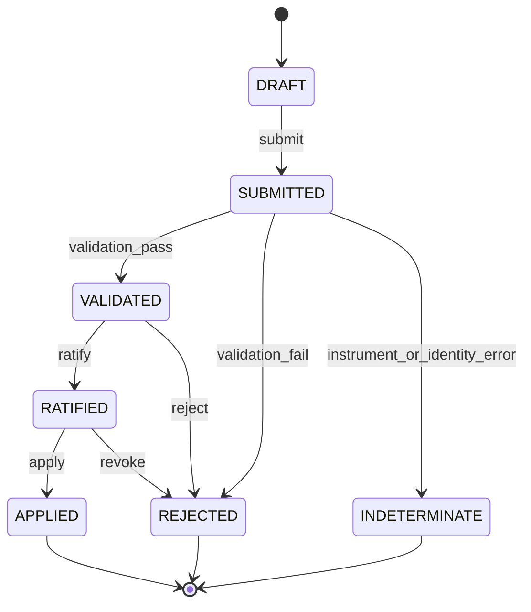

# Proposal state machine

Terminal states cannot transition. A new proposal is required after rejection,
indeterminacy, application, or any material change to the proposed bytes.

The implementation denies all transitions not explicitly listed. Actor permission,
separation-of-duty, protected-target, and revocation checks are additional guards around this
graph.
